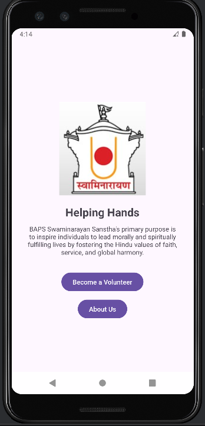
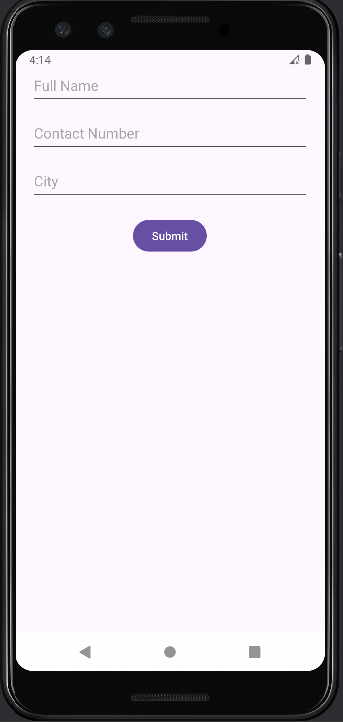
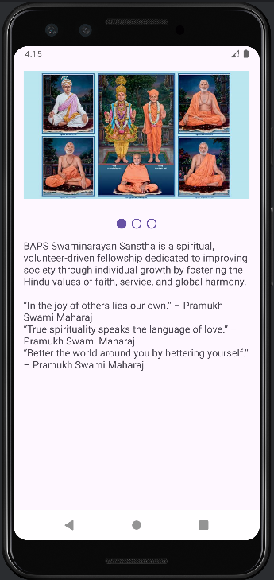

# BAPS-NGO-App
An Android app built in Java for BAPS Swaminarayan-inspired NGO, featuring volunteer registration, mission statement, and inspirational About Us section with image slider.

---

## 📱 Features

- 🏠 **Home Screen** — NGO name, logo, and mission statement
- 🧍 **Volunteer Form** — Collects name, contact number, and city
- ℹ️ **About Us Page** — Auto-slide image carousel with inspiring Swaminarayan quotes
- 🕉️ **Spiritual Branding** — Includes BAPS Swaminarayan-inspired design and content

---

## 🛠️ Tech Stack

- **Language:** Java
- **Framework:** Android SDK
- **UI Components:** ViewPager2, RecyclerView, TextView, XML Layouts
- **Tools Used:** Android Studio, Gradle
- **Image Slider:** ViewPager2 with auto-scroll and Dots Indicator (`com.tbuonomo:dotsindicator`)

---

## 🖼️ Screenshots

| Home Screen | Volunteer Form | About Us |
|-------------|----------------|----------|
|  |  |  |

---

## 📦 Getting Started

### Requirements
- Android Studio (Electric Eel or above recommended)
- Gradle 8+
- Android SDK 21+

### How to Run
1. Clone the repository  
   ```bash
   git clone https://github.com/amitit-6/BAPS-NGO-App.git

2. Open the project in Android Studio

3. Run it on an emulator or physical device

🤝 Contributing
Pull requests and feedback are welcome! Feel free to suggest spiritual quotes, improvements, or new features.

📄 License
This project is open source and free to use for non-commercial, spiritual, or educational purposes.

🙏 "In the joy of others lies our own." – Pramukh Swami Maharaj
